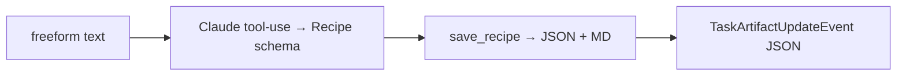

# Recipe Gen Agent

**Port:** `8002` (override with `RECIPE_GEN_PORT`)
**Skill:** `generate_recipe`
**Source:** `src/a2a_orchestrator/recipe_gen/`

## What it does

Generates a fresh `Recipe` from a freeform prompt using Claude tool-use. Persists `<slug>.json` and `<slug>.md`. Emits a JSON artifact.

## Card

```json
{
  "name": "recipe-gen",
  "description": "Generate a new structured recipe from a freeform prompt.",
  "skills": [{
    "id": "generate_recipe",
    "name": "generate_recipe",
    "description": "Generate a structured recipe from a natural-language prompt.",
    "examples": [
      "a spicy vegan ramen for 2",
      "a chocolate chip cookie recipe that uses browned butter"
    ]
  }]
}
```

## Pipeline



The agent's system prompt tells Claude to:

- Fill all fields in the Recipe schema.
- Keep `prep_steps` and `cooking_steps` ordered and self-contained.
- Leave `source_url` null (this is a generated recipe, not a scraped one — that's how the planner can tell the difference downstream).

## Failure modes

| Cause | Terminal state |
|---|---|
| Schema validation on Claude's output | `failed: generated recipe did not match schema` |
| Persist error | `failed: persist failed: <error>` |
| Anything else | `failed: <exception message>` |
