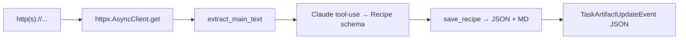

# Recipe URL Agent

**Port:** `8001` (override with `RECIPE_URL_PORT`)
**Skill:** `parse_recipe_url`
**Source:** `src/a2a_orchestrator/recipe_url/`

## What it does

Fetches a recipe URL, extracts the main text, asks Claude to structure it via tool-use into a `Recipe`, persists `<slug>.json` and `<slug>.md`, and emits a JSON artifact.

## Card

```json
{
  "name": "recipe-url",
  "description": "Parse a recipe from a URL into a structured recipe.",
  "skills": [{
    "id": "parse_recipe_url",
    "name": "parse_recipe_url",
    "description": "Fetch a URL and return a structured recipe.",
    "examples": ["https://example.com/ramen"]
  }]
}
```

## Pipeline



## Validation

The agent rejects any input that doesn't start with `http://` or `https://`:

```python
if not user_text.startswith(("http://", "https://")):
    enqueue(failed, "input must be an http(s) URL")
```

The fetch uses a 20-second timeout with redirects followed. Network errors map to a `failed` event.

After Claude emits the structured recipe, the agent **forces** `source_url = user_text` to make sure the artifact's `source_url` field is the URL the caller asked about, not whatever Claude inferred.

## Failure modes

| Cause | Terminal state |
|---|---|
| Non-URL input | `failed: input must be an http(s) URL` |
| Fetch error (timeout, DNS, 4xx, 5xx) | `failed: fetch failed: <error>` |
| Schema validation on Claude's output | `failed: structured recipe did not match schema` |
| Generic structuring error | `failed: structuring failed: <error>` |
| Persist error (disk full, permission) | `failed: persist failed: <error>` |

## Files

| File | Purpose |
|---|---|
| `__main__.py` | A2A app boot |
| `executor.py` | The pipeline above |
| `extract.py` | Main-text extraction (strips nav/footer/script/style) |
