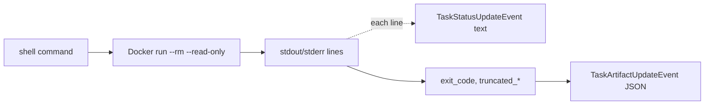

# Shell Agent

**Port:** `8003` (override with `SHELL_PORT`)
**Skill:** `run_shell`
**Source:** `src/a2a_orchestrator/shell/`

!!! warning "Local-only"
    The shell agent is **excluded from the example k8s deployment**. It relies on spawning Docker containers per request, which is incompatible with vanilla Kubernetes without significant additional plumbing (Job API, gVisor, Kata, Firecracker, etc.). A k8s-native sandbox is follow-up work.

## What it does

Runs a single shell command inside a fresh, throwaway Docker container with a read-only `/work` mount. Streams stdout/stderr lines as A2A status updates. Emits a JSON artifact summarizing exit code and output.

## Card

```json
{
  "name": "shell",
  "description": "Run a sandboxed shell command in a read-only workspace.",
  "skills": [{
    "id": "run_shell",
    "name": "run_shell",
    "description": "Run a shell command in a sandboxed container. Read-only workspace at /work. 30s timeout.",
    "examples": ["ls /work", "grep -r 'ramen' /work/recipes"]
  }]
}
```

## Pipeline



## Sandbox guarantees

The sandbox is intentionally minimal:

- Container is `--rm` and read-only, with `WORKSPACE_DIR` mounted at `/work` read-only.
- 30-second wall-clock timeout. Hitting it sets `timed_out: true` and SIGKILLs the container.
- stdout/stderr are individually capped; if the cap trips, `truncated_stdout` / `truncated_stderr` are `true` in the artifact payload.

## Artifact shape

```json
{
  "stdout": "...",
  "stderr": "...",
  "exit_code": 0,
  "timed_out": false,
  "truncated_stdout": false,
  "truncated_stderr": false
}
```

## Building the sandbox image

Before first use:

```bash
make shell-image
```

This builds the image referenced by `shell/sandbox.py`. See `scripts/build_shell_image.sh`.
