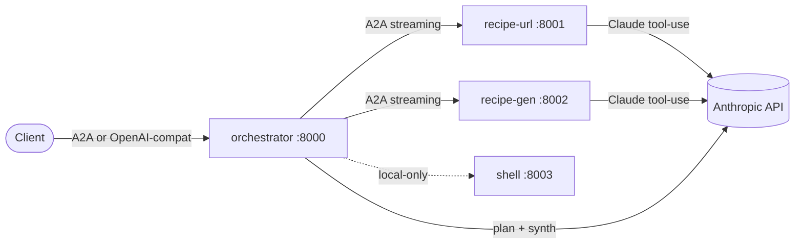
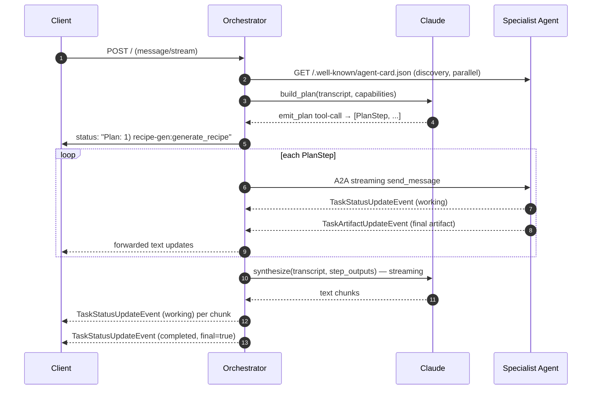

# Architecture Overview

## The four agents

Each agent is a separate ASGI application served by `A2AStarletteApplication` from the official `a2a` SDK. They share a small `common/` library: `a2a_helpers` (card builder, status/artifact event constructors, discovery), `claude` (Anthropic client + tool-use schema helper), `persistence` (Recipe → JSON + Markdown), `recipe` (Pydantic model + JSON Schema), `ratelimit` (per-IP middleware), and `logging` (structlog setup).

## Request lifecycle

## What the orchestrator owns

- **Discovery.** Fan-out HTTP GET against every base URL configured via `A2A_DISCOVERY_URLS` or `A2A_DISCOVERY_PORTS`. Cards are filtered to those that responded with valid JSON. See [Discovery](discovery.md).
- **Planning.** Anthropic tool-use forces Claude to emit a JSON plan that conforms to a fixed schema. See [Orchestration Loop](orchestration-loop.md).
- **Placeholder substitution.** `{{step_N.output}}` in any step's `input` is replaced with the prior step's final artifact text before dispatch.
- **Streaming.** Every child-agent event is forwarded back to the caller as a `TaskStatusUpdateEvent` text update. See [Streaming](streaming.md).
- **Synthesis.** Claude streams a natural-language reply that summarizes the user's request and the (potentially JSON) artifacts from each step.
- **History.** Per-`contextId` cache of the last 20 turns enables A2A clients to resume a session without resending the transcript. See [Conversation History](history.md).
- **Rate limiting.** Per-source-IP enforcement at the outer ASGI layer covering both the OpenAI-compat router and the mounted A2A app. See [Rate Limiting](rate-limiting.md).

## What specialist agents own

Each specialist is independently runnable, advertises its own card, and exposes one skill. They do not call each other; the orchestrator is the only entity that fans out.

- **recipe-url.** Fetch URL → extract main text → Claude tool-use into the `Recipe` schema → save → emit `application/json` artifact.
- **recipe-gen.** Claude tool-use into the `Recipe` schema → save → emit artifact.
- **shell.** Spawn a Docker container with a read-only `/work` mount, stream stdout/stderr lines as status updates, emit a JSON artifact summarizing exit code + truncated output.

## OpenAI-compatibility shim

`/v1/chat/completions` and `/v1/models` live alongside the A2A surface in the orchestrator process. The chat endpoint:

1. Concatenates the `messages` array into a transcript string.
2. Invokes `OrchestratorExecutor.execute()` against an in-memory `_AsyncQueue` shim.
3. Either drains the queue and returns a `ChatCompletionResponse`, or yields chunks as SSE `ChatCompletionChunk` frames terminated by `data: [DONE]`.

See [OpenAI-Compatible](../api/openai-compat.md) for the full request/response shape.
